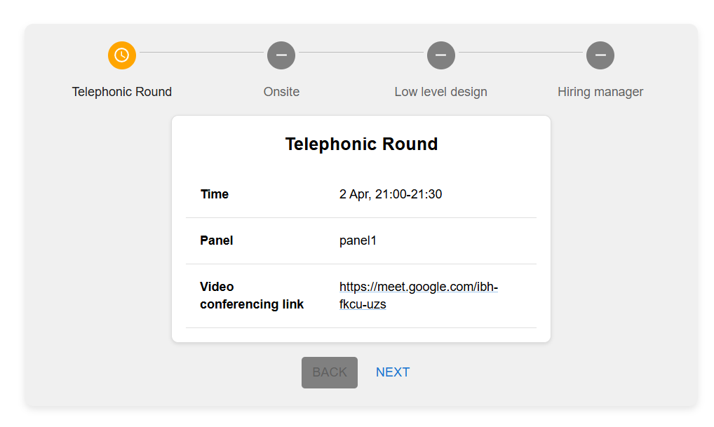

# Interview Stepper App

## Overview
This project is a React-based web application that provides an interactive stepper for interview rounds. It allows users to navigate through different interview stages, view details about each round, and access video conferencing links.

## Features
- Displays interview rounds in a step-by-step format
- Shows details such as time, panel members, and video links
- Custom stepper icons to indicate progress
- Navigation buttons to move forward and backward between steps

## Components
### 1. **InterviewDetails.jsx**
- Displays information about a specific interview round.
- Shows:
  - Interview round label
  - Scheduled time
  - Panel members
  - Video conferencing link

### 2. **StepperComponent.jsx**
- Implements a stepper using Material UI.
- Displays interview rounds dynamically based on provided data.
- Custom stepper icons to indicate completed, active, and pending steps.
- Buttons for navigation between steps.

### 3. **App.js**
- Integrates the stepper component into the main application.

## Technologies Used
- **React** for frontend UI
- **Material-UI** for components and styling
- **React Icons** for stepper icons

## Installation
1. Clone the repository:
   ```sh
   git clone https://github.com/deek-shan-t/interview-stepper
   ```
2. Navigate to the project folder:
   ```sh
   cd interview-stepper
   ```
3. Install dependencies:
   ```sh
   npm install
   ```
4. Start the development server:
   ```sh
   npm start
   ```

## Usage
- Click "Next" to proceed to the next interview round.
- Click "Back" to revisit the previous round.
- Click "Finish" on the last step to complete the process.

## Screenshots


## Deployment
[Live Demo](#) (Add deployment link here)

